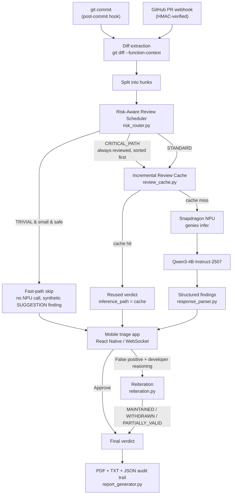
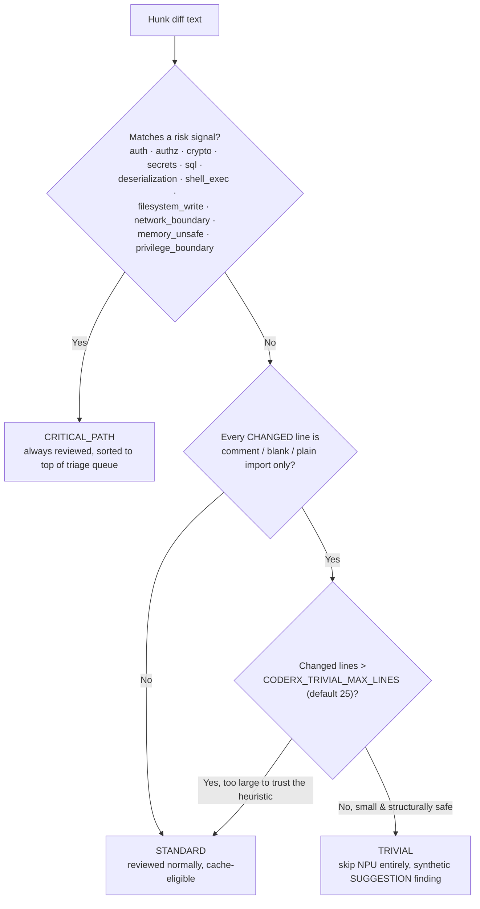
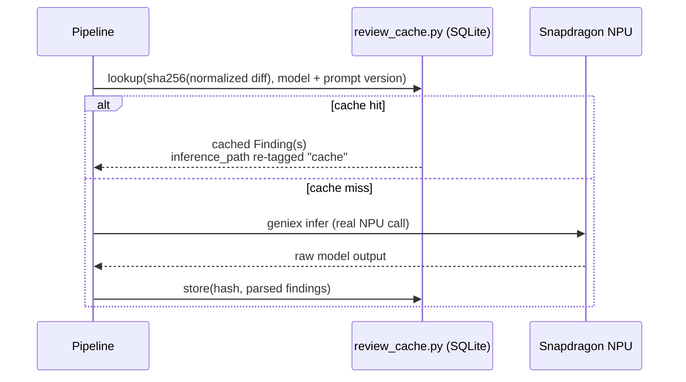

# CoderX

### Private AI Code Review. Powered by Snapdragon.


Built for the **Snapdragon® Multiverse Hackathon** (Bangalore). Submission
complete — results pending.

---

## Table of contents

1. [Problem](#1-problem)
2. [Solution](#2-solution)
3. [Why on-device AI](#3-why-on-device-ai)
4. [Why Snapdragon](#4-why-snapdragon)
5. [Architecture](#5-architecture)
6. [AI pipeline](#6-ai-pipeline)
7. [Risk-aware routing](#7-risk-aware-routing)
8. [Incremental review cache](#8-incremental-review-cache)
9. [NPU inference](#9-npu-inference)
10. [Human-in-the-loop reiteration](#10-human-in-the-loop-reiteration)
11. [Privacy](#11-privacy)
12. [Offline capability](#12-offline-capability)
13. [Benchmarks](#13-benchmarks)
14. [Installation](#14-installation)
15. [Snapdragon setup](#15-snapdragon-setup)
16. [Demo](#16-demo)
17. [Screenshots](#17-screenshots)
18. [Technical details](#18-technical-details)
19. [Limitations](#19-limitations)
20. [Future work](#20-future-work)
- [Team](#team) · [References](#references) · [License](#license)

---

## 1. Problem

AI code review tools (GitHub Copilot, CodeRabbit, Cursor, etc.) are great,
but every one of them sends your source code to a cloud API. For a huge
class of developers — fintech, healthtech, defense, government, or just
companies with a strict data-residency policy — that's a non-starter. India
alone has an estimated 5.8M developers, and a meaningful slice of them work
somewhere that simply will not permit proprietary code to leave the
building, let alone the country.

## 2. Solution

CoderX answers a simple question: **can you get a genuinely useful AI code
reviewer without any of the code ever touching the network?**

`git commit` (or a GitHub PR) triggers diff extraction → a local LLM
running **entirely on a Snapdragon NPU** analyzes the diff → findings
stream live to a mobile triage app → the developer approves each finding or
flags it as a false positive → the AI reconsiders flagged findings given
the developer's reasoning → a final PDF/JSON report is generated on-device.

- ✅ Runs entirely on Snapdragon NPUs — no cloud API, no CPU fallback needed
- ✅ Reviews Git commits and GitHub PRs automatically
- ✅ Never uploads a single line of source code
- ✅ Risk-aware routing prioritizes sensitive changes and skips genuinely
  trivial ones before they reach the NPU
- ✅ Incremental cache skips re-reviewing a hunk it has already seen
- ✅ Lets the developer push back — the AI reconsiders any finding flagged
  as a false positive, given the developer's reasoning
- ✅ Generates an offline PDF + structured JSON audit trail

## 3. Why on-device AI

The answer is yes — **if the model runs on the same machine that owns the
code**, and modern Snapdragon NPUs are fast enough to make that practical
rather than theoretical. The alternative (send the diff to a cloud API) is
a non-starter for the exact developers CoderX targets, so on-device
inference isn't a performance optimization here — it's the feature that
makes the product usable at all for its intended audience.

## 4. Why Snapdragon

CoderX runs a 4B-parameter instruction-tuned model (Qwen3-4B-Instruct-2507)
entirely on-NPU via **Qualcomm AI Hub / GenieX**, confirmed end-to-end on
Snapdragon X Elite hardware — not a CPU fallback, not a mock (see
[Benchmarks](#13-benchmarks) for the measured numbers, and
[NPU inference](#9-npu-inference) for exactly how `geniex infer` is
invoked). Three properties of Snapdragon's NPU specifically make this
product possible rather than merely nice-to-have:

- **Enough throughput to be usable interactively.** A 4B-parameter model
  reviewing a diff the moment you commit needs real tokens/second, not
  cloud-GPU-class but also not "leave it running overnight" CPU-only
  speed. See the measured prefill/decode numbers in section 13.
- **Efficient enough to run alongside normal dev work**, not a dedicated
  inference server — the NPU handles this without monopolizing the CPU the
  developer is also using for their editor, browser, and build tools.
- **A supported path to close the loop with GenieX/QAIRT** — Qualcomm AI
  Hub is what let this team benchmark and select Qwen3-4B-Instruct-2507
  in the first place (see [Tech stack](#18-technical-details)), and GenieX
  is the one-shot CLI that makes NPU inference callable from a normal
  Python backend without a bespoke native integration.

## 5. Architecture



Both entrypoints (the local git hook and the GitHub webhook) converge on the
same router → cache → NPU pipeline — an earlier audit of this codebase
found the webhook path had its own older copy of the review loop that
predated the router/cache entirely, which has since been fixed so a PR
review gets identical treatment to a local commit review.

## 6. AI pipeline

Each hunk is reviewed independently, not the whole diff at once:

1. `diff_extractor.py` runs `git diff --function-context`, so each hunk
   carries its full enclosing function, not just the default 3 lines of
   context.
2. `prompt_builder.py` wraps the hunk in a fixed-format instruction prompt
   (`PROMPT_TEMPLATE`, versioned as `PROMPT_TEMPLATE_VERSION` so a prompt
   edit automatically invalidates any cached verdicts produced under the
   old wording).
3. `llm_client.py` dispatches to `geniex infer` (NPU) or Ollama (CPU
   dev/fallback), selected by `CODERX_BACKEND`.
4. `response_parser.py` parses the model's `[SEVERITY] file:line —
   description. Fix: ...` formatted text into structured `Finding` objects,
   now carrying provenance metadata (`category`, `inference_path`, `model`,
   and an honestly-`None` `confidence` — see section 19).

## 7. Risk-aware routing

`risk_router.py` classifies every hunk **on-device, with zero model
calls**, before anything reaches the NPU:



Two safeguards exist specifically to prevent a heuristic false-negative
from hiding a meaningful change:

- **Risk signals always win**, checked first — a comment line that happens
  to mention `sudo` or `subprocess` still routes `CRITICAL_PATH`.
- **A size cap** (`CODERX_TRIVIAL_MAX_LINES`, default 25) — a large
  diff that structurally *looks* trivial (e.g. a 40-line bulk comment
  edit) is escalated to `STANDARD` and reviewed anyway, never silently
  skipped, on the reasoning that large mechanical-looking diffs are
  exactly where a heuristic is most likely to miss something.

One caveat worth stating plainly: because diff extraction uses
`--function-context`, a hunk's diff text includes unchanged surrounding
lines, and risk-signal matching runs against that full text — so editing a
comment a few lines above an existing SQL query still classifies
`CRITICAL_PATH`. This is intentionally conservative (errs toward review,
not toward missing a sensitive area), and the `TRIVIAL` fast-path is
unaffected by it, since that path separately requires every *changed*
line specifically to be safe.

Every commit prints a routing summary, e.g.:

```
Commit 4c1d4ee
  4 hunk(s)

  CRITICAL_PATH   1
  STANDARD        2
  TRIVIAL         1

  NPU reviews performed: 3
  Served from cache:     0  (hit rate: 0%)
  Skipped (fast-path):   1
```

## 8. Incremental review cache



- **Normalized hashing** — `@@ -N,M +N,M @@` line-number headers are
  stripped before hashing, so a hunk that shifted a few lines because of
  an earlier edit elsewhere in the file still hits the cache if the actual
  changed code is identical.
- **Model + prompt-version namespacing** — the cache key is
  `{backend}:{model}@prompt-{version}`, so switching `CODERX_GENIE_MODEL`
  or editing `PROMPT_TEMPLATE` never serves a stale verdict from a
  different model or instruction set.
- **Deterministic invalidation** — `review_cache.invalidate_model()` /
  `invalidate_all()`, or `python review_cache.py --clear`, rather than
  implicit TTL/expiry logic.
- **Storage** — a single local SQLite file
  (`backend/coderx_cache.db`), no network, no server dependency.

Measured behavior (this repository's own test run, reproducible via
`python demo.py`): reviewing the same commit a second time produced **0
new NPU calls, 100% cache hit rate**, with `review_cache.lookup()`
returning the original findings including their original `category` and
`model` metadata, re-tagged `inference_path: "cache"` for that run.

## 9. NPU inference

`llm_client.py` selects the backend via `CODERX_BACKEND` (`qnn` by
default):

```bash
geniex infer ai-hub-models/Qwen3-4B-Instruct-2507 -c npu --prompt-file ...
```

| Variable | Purpose | Default |
|---|---|---|
| `CODERX_GENIE_MODEL` | Model identifier passed to `geniex infer` | `ai-hub-models/Qwen3-4B-Instruct-2507` |
| `CODERX_GENIE_COMPUTE` | Compute target | `npu` |
| `CODERX_GENIE_THINK` | Model's thinking-mode toggle | `false` |
| `CODERX_GENIE_PROMPT_FILE` | Path to the fixed prompt file `geniex` reads from | `backend/coderx_geniex_prompt.txt` |

Ollama (`CODERX_BACKEND=ollama`) is the CPU dev/fallback path for machines
without a Snapdragon NPU — functionally identical pipeline, just slower
and not NPU-accelerated. `CODERX_MOCK_LLM=1` bypasses the LLM entirely with
a canned response, for testing pipeline mechanics (routing, caching,
report generation) without any model call at all — always clearly labeled
`backend=mock` in logs and benchmark output, never presented as a real
inference result.

## 10. Human-in-the-loop reiteration

```mermaid
flowchart LR
    F["AI finding"] --> D{"Developer decision"}
    D -->|Approve| Final1["Final verdict: Approved"]
    D -->|"False positive<br/>(a real reason is required)"| R["Reiteration<br/>original diff + developer's comment<br/>re-sent to the LLM"]
    R --> V{"Model verdict"}
    V -->|MAINTAINED| Final2["Finding stands"]
    V -->|WITHDRAWN| Final3["Finding
